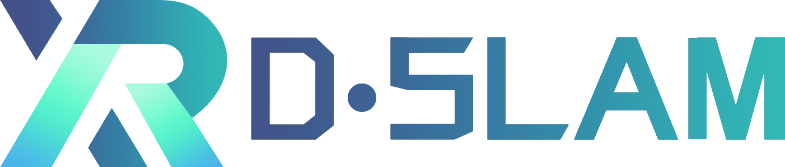
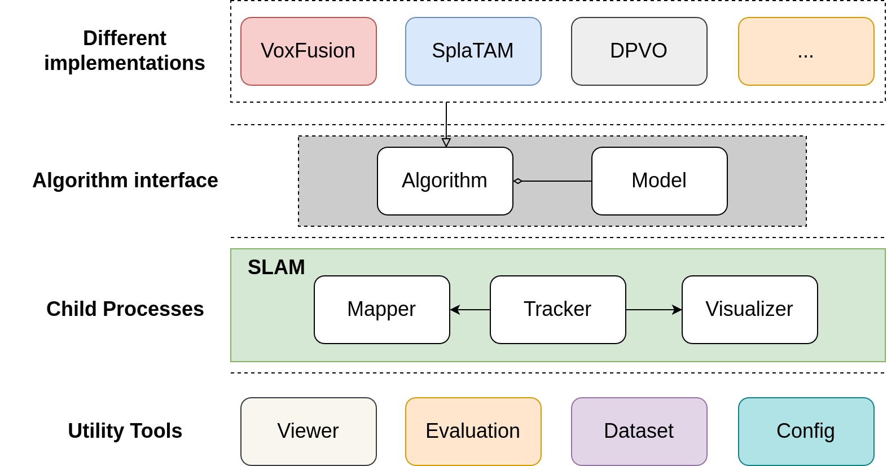
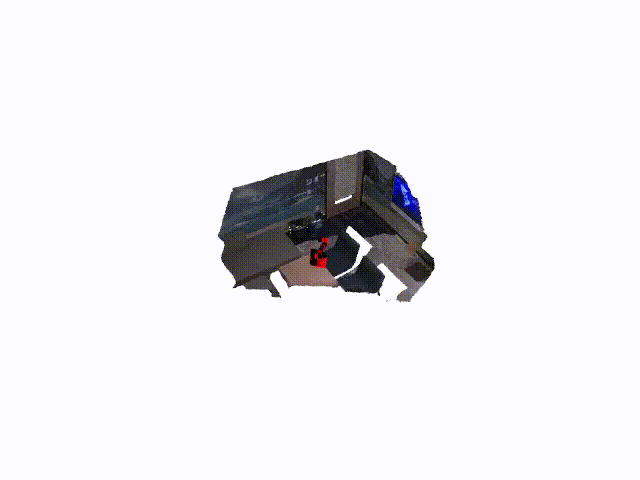
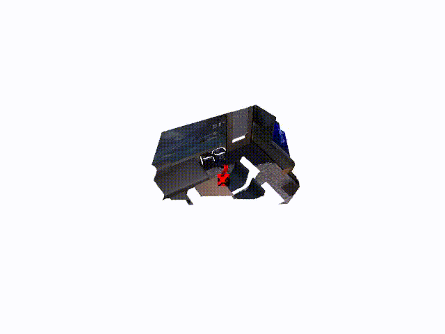
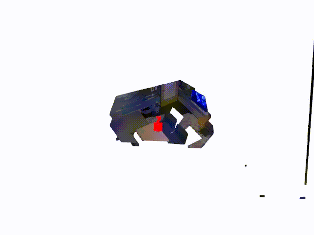
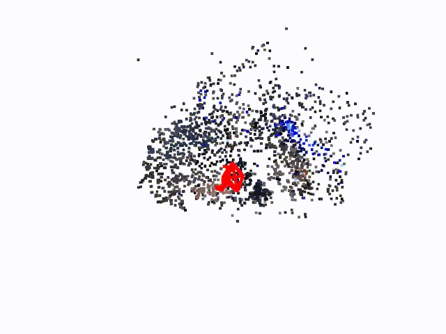
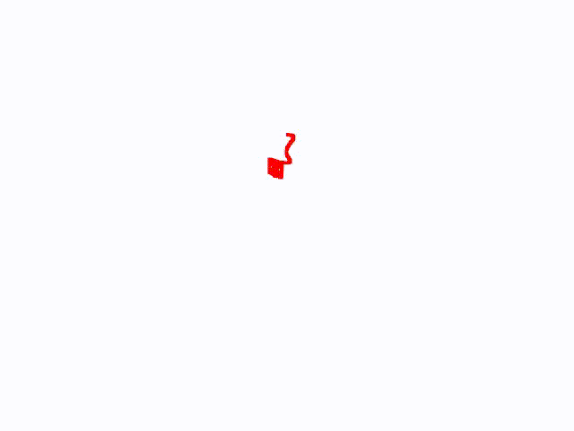
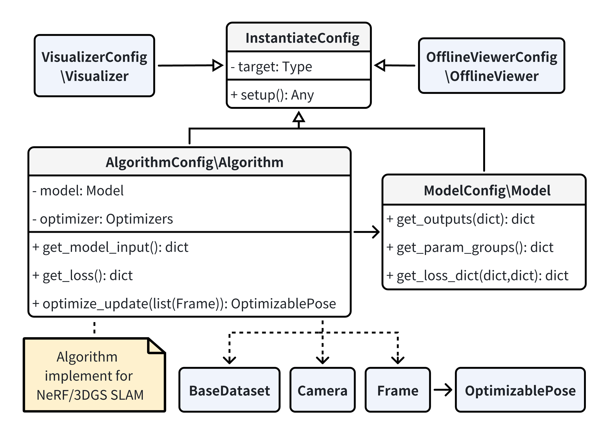

<br/>

<div align="center">
    
</div>
<br/>

<div align="left">
<div align="left">

[](https://github.com/openxrlab/xrdslam/actions/workflows/lint.yml) [](https://github.com/openxrlab/xrdslam/blob/master/LICENSE)

</div>

## Introduction

OpenXRLab Deep-learning based SLAM Toolbox and Benchmark. It is a part of the OpenXRLab project.



We provide a set of pre-implemented deep-learning based SLAM algorithms.

**Replica/office0**

<table>
  <tr>
    <th><a href="https://github.com/cvg/nice-slam">NICE-SLAM</a></th>
    <th><a href="https://github.com/HengyiWang/Co-SLAM">Co-SLAM</a></th>
    <th><a href="https://github.com/zju3dv/Vox-Fusion">Vox-Fusion</a></th>
    <th><a href="https://github.com/eriksandstroem/Point-SLAM">Point-SLAM</a></th>
    <th><a href="https://github.com/spla-tam/SplaTAM">SplaTAM</a></th>
    <th><a href="https://github.com/princeton-vl/DPVO">DPVO</a></th>
    <th><a href="https://github.com/zju3dv/NeuralRecon">NeuralRecon</a></th>
  </tr>
  <tr>
    <td></td>
    <td></td>
    <td></td>
    <td></td>
    <td></td>
    <td></td>
    <td></td>
  </tr>
</table>

## Quickstart

### 1. Installation

**(Recommended)**

XRDSLAM has been tested on python 3.10, CUDA>=11.8. The simplest way to install all dependences is to use [anaconda](https://www.anaconda.com/) and [pip](https://pypi.org/project/pip/) in the following steps:

```bash
conda create -n xrdslam python=3.10
conda activate xrdslam
conda install pytorch==2.1.1 torchvision==0.16.1 torchaudio==2.1.1 pytorch-cuda=11.8 -c pytorch -c nvidia
pip install -r requirements.txt
```

Alternatively, we also provide a conda environment.yml file :

```bash
conda env create -f environment.yml
conda activate xrdslam
```

**Build extension**

```
cd third_party
bash install.sh
```

### 2. Build and Run

```bash
# installing xrdslam
cd xrdslam
pip install -e .
```

```bash
# [0] Download some test data
ds-download-data  --capture-name  replica
# [1] Place devices.yaml from configs in the directory of the downloaded dataset.  data/replica/Replica/office0/devices.yaml
# [2] run co-slam without online visualizer, when finished, the re-rendered images and mesh/cloud will be saved in "outputs"
ds-run co-slam --data  data/replica/Replica/office0  --data-type replica
# [2] run co-slam with online visualizer
ds-run co-slam --data  data/replica/Replica/office0  --data-type replica  --xrdslam.enable-vis True  --xrdslam.tracker.render-freq  5
# [3] eval co-slam
ds-eval  --output-dir  ./outputs --gt-mesh  ./data/replica/cull_replica_mesh/office0.ply
# [4] use offline viewer
ds-viewer --config.vis-dir  ./outputs/
```

Note: If you have limited memory, you can set downsample_factor: 2 in devices.yaml to run the demo.

### 3. Commands

#### ds-download-data

```bash
usage: ds-download-data [-h] [--save-dir PATH] [--capture-name {f1_desk,f1_desk2,f1_room,f2_xyz,f3_office,replica,neural_rgbd_data,apartment,all}]
```

##### options

- --save-dir

  The directory to save the dataset to (default: data)

- --capture-name

  Possible choices: f1_desk,f1_desk2,f1_room,f2_xyz,f3_office,replica,neural_rgbd_data,apartment,all (default: f1_desk)

#### ds-run

Primary interface to run xrdslam.

```bash
usage: ds-run [-h] {nice-slam,vox-fusion,co-slam,point-slam,splaTAM}
```

The minimal command is:

```bash
ds-run nice-slam --data YOUR_DATA --data-type DATA_TYPE
```

To learn about the available algorithms:

```
ds-run -h
```

To learn about a algorithms parameters:

```
ds-run {algorithm} -h
```

#### ds-viewer

Start the offline viewer.

```bash
usage: ds-viewer [-h] [--config.vis-dir PATH] [--config.save-rendering {True,False}] [--config.algorithm-name {None}|STR]
```

##### options

- --config.vis-dir

  Offline data path from xrdslam. (default: outputs)

- --config.save-rendering

  Save the rendering result or not. (default: True)

- --config.algorithm-name

  NOTE: When use splaTAM or DPVO or NeuralRecon, algorithm name should be set. (default: None)

#### ds-eval

Evaluate trajectory accuracy and 3D reconstruction quality.

```bash
usage: ds-eval [-h] --output-dir PATH --gt-mesh {None}|STR
```

##### options

- --output-dir

  Path to xrdslam running result. (required)

- --gt-mesh

  Path to ground-truth mesh file. (required)

- --correct-scale

  NOTE: When evaluating the trajectory of DPVO, "--correct-scale" should be used.

### 4. Adding your own algorithm

The figure below is the algorithm pipeline. When adding a new deep-learning based SLAM algorithm, you need to register the algorithm in **input_config.py** and re-inherit and implement the functions in the **Algorithm** and **Model** classes. For details, please see [adding_a_new_algorithm ](docs/adding_a_new_algorithm.md)



### 5. Benchmark

Here are the comparison results on **Replica** datasets. The results of the original algorithm comes from multiple papers.

The algorithms with * suffix are the corresponding algorithms in the XRDSLAM framework. For details, see [benchmark](docs/benchmark.md).

(DPVO is a visual odometry (VO) algorithm that does not generate meshes, and  DPVO paper does not provide results for the Replica datasets. Therefore, here we only present the trajectory metrics from  XRDSLAM framework.  The comparison results of DPVO for the Euroc dataset can be found in the [benchmark](docs/benchmark.md). NeuralRecon is a mapping algorithm, and  NeuralRecon paper does not provide results for the Replica datasets. Therefore, here we only present the mesh metrics from  XRDSLAM framework.  The comparison results of NeuralRecon for the 7Scenes dataset can be found in the [benchmark](docs/benchmark.md).)

Note: The default configuration in the algorithm is suitable for Replica. If you use other datasets, you need to modify the corresponding configuration items in slam/configs/input_config.py.

| Algorithm       | ATE RMSE [cm] -     | PSNR+ | SSIM+ | LPIPS- | Precision [%] + | Recall [%] + | F1[%] + | Depth L1[cm] - | Acc. [cm]-     | Comp. [cm]-    | Comp. Ratio [<5cm %] + |
| ------------ | ------------------- | ----- | ----- | ------ | --------------- | ------------ | ------- | -------------- | -------------- | -------------- | ---------------------- |
| NICE-SLAM    | **1.95** | 24.42 | 0.81  | **0.23** | 44.10           | **43.69**    | **43.86** | 3.53 | 2.85 | **3.00**    | **89.33**  |
| NICE-SLAM* | 2.09                | **25.68** | **0.85** | 0.32   | **46.62**       | 37.53        | 41.47   | **2.62**       | **2.03**       | 3.38           | 87.81                  |
| Co-SLAM      | **0.86**   | 30.24 | **0.93** | 0.25   | -               | -            | -       | **1.51**       | 2.10           | **2.08**       | **93.44**              |
| Co-SLAM*  | 1.11                | **30.34** | **0.93** | **0.24** | 80.66           | 68.79        | 74.23   | 1.63           | **1.53**       | 2.90           | 89.81                  |
| Vox-Fusion   | **0.54** | 24.41 | 0.80  | **0.24** | 55.73           | 49.13        | 52.20   | 2.46      | 2.37           | **2.28**       | **92.86**              |
| Vox-Fusion* | 0.56                | **27.95** | **0.90** | 0.25   | **89.52**       | **71.34**    | **79.39** | **1.03**       | **1.39**       | 2.82           | 90.13                  |
| Point-SLAM   | 0.52           | **35.17** | **0.97** | 0.12   | 96.99           | 83.59        | 89.77   | 0.44           | -              | -              | -                      |
| Point-SLAM* | **0.47**            | 34.10 | **0.97** | **0.10** | **99.30**       | **83.78**    | **90.86** | **0.38**       | 1.25           | 3.12           | 88.15                  |
| SplaTAM      | **0.36**            | 34.11 | **0.97** | 0.10   | -               | -            | -       | -              | -              | -              | -                      |
| SplaTAM*   | 0.40                | **34.44** | 0.96  | **0.09** | -               | -            | -       | -              | -              | -              | -                      |
| DPVO* | 0.31 | - | - | - | - | - | - | - | - | - | - |
| NeuralRecon* | - | - | - | - | 13.29 | 7.43 | 9.51 | - | 5.87 | 19.36 | 38.13 |

## License

The license for our codebase is under the [Apache-2.0](LICENSE).
Please note that this license only applies to the code in our library, the dependencies of which are separate and individually licensed. In the source code files, we have made specific licensing declarations for the third-party code being used. We would like to pay tribute to open-source implementations to which we rely on. Please be aware that utilizing both external dependencies and the fundamental code from their original sources might impact our codebase's licensing.

## Contributing

We appreciate all contributions to improve XRDSLAM. Please refer to [contributing.md](docs/contributing.md) for the contributing guideline.

## Acknowledgement

In addition to the implemented algorithm ([NICE-SLAM](https://github.com/cvg/nice-slam),[Co-SLAM](https://github.com/HengyiWang/Co-SLAM),[Vox-Fusion](https://github.com/zju3dv/Vox-Fusion),[Point-SLAM](https://github.com/eriksandstroem/Point-SLAM),[SplaTAM](https://github.com/spla-tam/SplaTAM), [DPVO](https://github.com/princeton-vl/DPVO), [NeuralRecon](https://github.com/zju3dv/NeuralRecon)), our code also adapt some codes from [Nerfstudio](https://github.com/nerfstudio-project/nerfstudio/), [Sdfstudio](https://autonomousvision.github.io/sdfstudio/). Thanks for making the code available.

## Built On

<a href="https://github.com/brentyi/tyro">
<!-- pypi-strip -->

<picture>
    <source media="(prefers-color-scheme: dark)" srcset="https://brentyi.github.io/tyro/_static/logo-dark.svg" />
<!-- /pypi-strip -->
    
<!-- pypi-strip -->
</picture>

<!-- /pypi-strip -->
</a>

- Easy-to-use config system
- Developed by [Brent Yi](https://brentyi.com/)


## Citation
You can find a paper writeup of the framework on [arXiv](https://arxiv.org/abs/2410.23690).

If you use this toolbox or benchmark in your research, please cite this project.

```bibtex
@misc{wang2024xrdslamflexiblemodularframework,
      title={XRDSLAM: A Flexible and Modular Framework for Deep Learning based SLAM},
      author={Xiaomeng Wang and Nan Wang and Guofeng Zhang},
      year={2024},
      eprint={2410.23690},
      archivePrefix={arXiv},
      primaryClass={cs.CV},
      url={https://arxiv.org/abs/2410.23690},
}
```

## Projects in OpenXRLab

- [XRPrimer](https://github.com/openxrlab/xrprimer): OpenXRLab foundational library for XR-related algorithms.
- [XRSLAM](https://github.com/openxrlab/xrslam): OpenXRLab Visual-inertial SLAM Toolbox and Benchmark.
- [XRDSLAM](https://github.com/openxrlab/xrdslam): OpenXRLab Deep-learning based SLAM Toolbox and Benchmark.
- [XRSfM](https://github.com/openxrlab/xrsfm): OpenXRLab Structure-from-Motion Toolbox and Benchmark.
- [XRLocalization](https://github.com/openxrlab/xrlocalization): OpenXRLab Visual Localization Toolbox and Server.
- [XRMoCap](https://github.com/openxrlab/xrmocap): OpenXRLab Multi-view Motion Capture Toolbox and Benchmark.
- [XRMoGen](https://github.com/openxrlab/xrmogen): OpenXRLab Human Motion Generation Toolbox and Benchmark.
- [XRNeRF](https://github.com/openxrlab/xrnerf): OpenXRLab Neural Radiance Field (NeRF) Toolbox and Benchmark.
